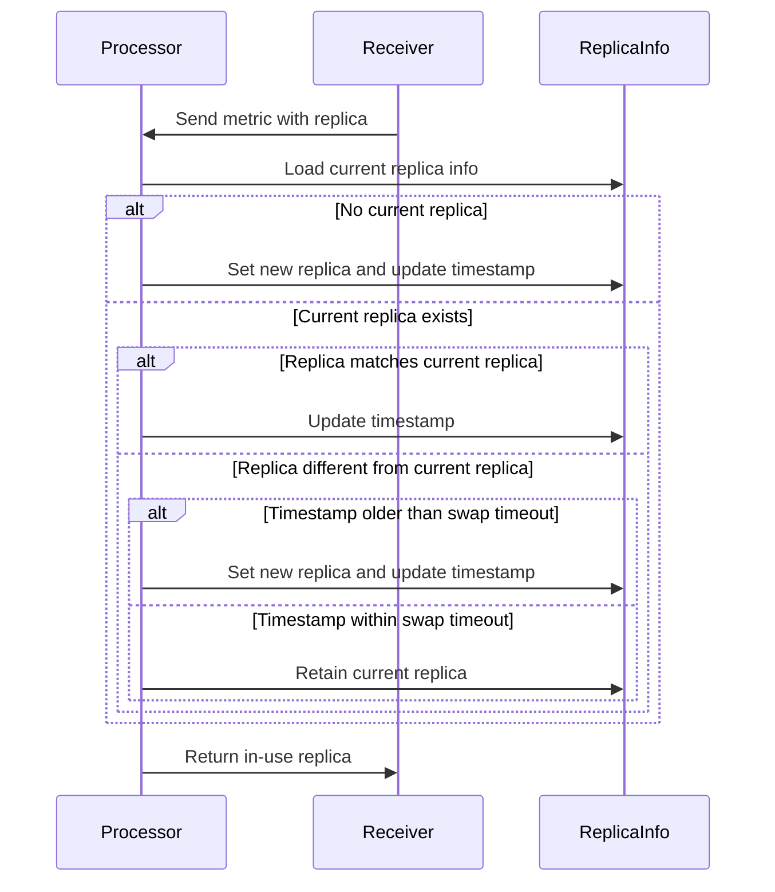

# Metrics Dedup Processor

<!-- status autogenerated section -->
| Status        |           |
| ------------- |-----------|
| Stability     | [development]: metrics   |
| Distributions | [] |
| Issues        | [](https://github.com/open-telemetry/opentelemetry-collector-contrib/issues?q=is%3Aopen+is%3Aissue+label%3Aprocessor%2Fgroupby) [](https://github.com/open-telemetry/opentelemetry-collector-contrib/issues?q=is%3Aclosed+is%3Aissue+label%3Aprocessor%2Fgroupby) |
| [Code Owners](https://github.com/open-telemetry/opentelemetry-collector-contrib/blob/main/CONTRIBUTING.md#becoming-a-code-owner)    | [@nicolastakashi](https://www.github.com/nicolastakashi) |

[development]: https://github.com/open-telemetry/opentelemetry-collector#development
<!-- end autogenerated section -->

## Description

This processor deduplicates metrics by ensuring that only metrics from the in-use replica are retained.

```yaml
processors:
  metricsdedup:
    replica_label: replica
    swap_timeout: 5m
```

## Defining in use replica

Below you can find the logic used to determine the in-use replica:

